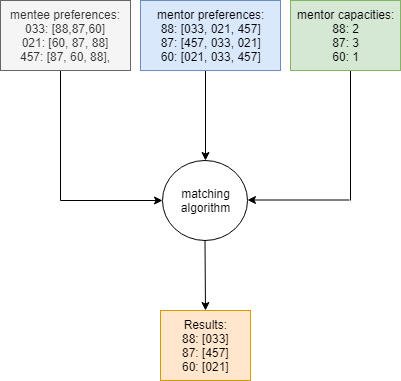

*****
Matching Algorithim
*****

A python implementation of the Gale-Shapley algorithm to determine the best combination of mentor and mentee pairs for the Undergraduate Research Opportunities Research Experience program at UBC.

Usage
########

Mentee and mentor preferences as well as mentor capacities are provided in respective csv files. Program outputs a csv file with computed matchings. 

Future
########
More documentation
